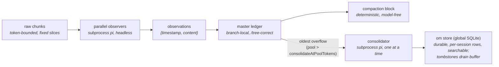

# observational-memory

Tiered, subprocess-backed memory for pi.

Parallel **observers** distill raw conversation chunks into atomic observations committed to the master's branch-local **ledger** (so memory stays correct under `/tree`); a deterministic, model-free **compaction** renders that buffer verbatim into the compaction block. A **consolidator** promotes the oldest observations into the **durable om store** (one global SQLite database, rows keyed per session), bounding the buffer and giving each session durable, searchable long-term memory that the master can read with the read-only `om_memory` tool (a fork seeds its memory from its parent).

## On/off gate (default OFF)

The extension ships in the global extensions folder during development, so it is **gated off
per session** and is completely invisible until you turn it on.

- `/om` — toggle for this session
- `/om on` / `/om off` — set explicitly

State persists per session in the ledger (`om.enabled`) and survives resume. When off, every
trigger, hook, widget, and subprocess returns immediately.

## How it works



Pipeline: raw chunks → observers → observations → ledger → compaction block, with a
consolidator draining the oldest observations into the durable om store.

- **Observer clock** (`turn_end` / `agent_start`): every `chunkTokens` of new raw history,
  cut a fixed-token slice and fire an observer subprocess. Observers are embarrassingly
  parallel pure mappers (capped by `observerConcurrency`); each commits its own
  `coversUpToId` watermark, so out-of-order completion is fine.
- **Observation** = `{ timestamp, content, tokenCount }`. The precise event-`timestamp`
  doubles as the id; the orchestrator re-derives a unique, second-resolution id at commit
  (the observer only emits minute resolution).
- **Compaction** (`agent_end` over `compactAtContextTokens`, when idle): waits for in-flight
  observers, then renders the active buffer plus a **memory map** (rendered live from the store's
  topic index) and a **journey** section (the session's journey row, read verbatim). The cutoff snaps to an observation chunk boundary so the verbatim tail is never
  double-represented.
- **Consolidator clock** (`turn_end` / `agent_start`): when the active observation pool
  exceeds `consolidateAtPoolTokens`, a single background consolidator subprocess folds the
  **oldest** observations (above `poolTargetTokens`) into the durable om store, then the
  orchestrator tombstones exactly the observations it reports — draining the buffer back toward
  target. Store rows are **scoped per session** (keyed by the immutable session-header id, so two
  sessions in the same project never share output) and track the session, not the branch: they are
  **not** rolled back by `/tree`. On a fork/clone the new session's rows are **copied once** from
  the parent (`om fork-copy`, only if the destination is empty — matching the ledger, which
  already travels with the fork). The consolidator addresses topics **by slug** through its own
  `ls`/`grep`/`read`/`write`/`edit` tools (shims over the store); the reserved slug `JOURNEY`
  addresses the session's journey row.
- **Journey** (the session's journey row in the store): a single, whole-project, purely
  **descriptive** prose history of how the work got to its current state, maintained by the
  consolidator and pushed into every compaction block for **orientation** (not recall, not
  instructions). It is append-mostly: each consolidation adds a short dated segment and compresses
  the oldest segments only once the journey exceeds `journeyTargetTokens`, so recent history stays
  detailed and the section stays bounded. Like topics it does **not** roll back under `/tree`.

Each worker is an **ordinary recorded pi session** in the global store
(`~/.pi/agent/sessions`, under the project path) — open it in the session browser to see the
exact input chunk, tool calls, and output. Transient handoff files live in
`~/.pi/agent/om/runs/`.

### Cost tracking

Every worker is a `pi` subprocess, so its spend is captured from pi's **built-in**
`usage.cost.total` (reliable, already computed). The worker extension — *not* the model —
accumulates that figure and hands it back via the run's cost file
(`~/.pi/agent/om/runs/<runId>.cost.json`), alongside the existing observation IPC. The orchestrator
folds each run into an `om.cost` ledger entry.

- **Ephemeral-safe:** cost rides the result-file IPC, never a saved session log, so it works
  even if a worker session is not persisted.
- **Never rolls back:** the running total sums *all* `om.cost` entries across the whole
  session (every branch), so real money spent does not decrease under `/tree` — the same
  tier rule as the durable store.
- **Surfaced** in the footer (`$0.000`, right of the gauges) and in `/om:status`
  (`session cost: $X (N runs)`). Survives resume.

## Commands

| Command | Effect |
|---|---|
| `/om`, `/om on`, `/om off` | The per-session on/off gate |
| `/om:status` | Active profile, workers in flight, active observation count, next-observer progress, pool/consolidator state, topic count, journey size, context usage, **session cost**, last error |
| `/om:compact` | Force a compaction now (ignores the threshold) |
| `/om:consolidate` | Force a consolidation now (ignores the pool threshold) |

## Configuration

Namespace `observational-memory` in `~/.pi/agent/settings.json` (global) or
`.pi/settings.json` (project; overrides global):

```jsonc
{
  "observational-memory": {
    "chunkTokens": 5000,
    "chunkOverlapTokens": 0,
    "poolTargetTokens": 10000,           // buffer drains back toward this after consolidation
    "consolidateAtPoolTokens": 20000,    // pool size that triggers a consolidation (200% of target)
    "compactAtContextTokens": 100000,    // tune per model
    "tailTokens": 20000,                 // verbatim tail; snaps to a chunk boundary
    "journeyTargetTokens": 1000,         // pushed journey size; compress oldest segments past this
    "observerConcurrency": 4,
    "models": {
      "observer":     { "provider": "anthropic", "id": "claude-sonnet-4-6", "thinking": "low" },
      "consolidator": { "provider": "anthropic", "id": "claude-sonnet-4-6", "thinking": "medium" }
    },
    "passive": false,
    "debugLog": false,
    "displayMode": "bar"               // "bar" | "dense" | "off" — TUI footer rendering
  }
}
```

A block may name a **named profile** — the mechanism for context-size modes, e.g. a ~20k-context
profile where compaction and consolidation run far more often — and direct keys in the same block
override individual profile knobs (models merge per-model across profile and direct keys):

```jsonc
{
  "observational-memory": {
    "profile": "small-ctx",
    "profiles": {
      "small-ctx": {
        "chunkTokens": 4000, "tailTokens": 3000, "poolTargetTokens": 3000,
        "consolidateAtPoolTokens": 5000, "compactAtContextTokens": 18000
      }
    },
    "journeyTargetTokens": 800   // direct key overrides just this profile knob
  }
}
```

An unknown profile name is ignored; precedence across files is unchanged (defaults < global <
project < env). `/om:status` shows the active profile.

`PI_OM_PASSIVE=1` forces `passive` (disables all triggers) for clean `/tree` testing.
`passive` is a power-user setting distinct from the on/off gate.

### Display mode (`displayMode`)

`bar` (default) is the current look: gauges live in the footer status line, and worker
indicators stack as transient widgets above it. `dense` keeps the footer as a bare `om` label
and renders a permanent two-line widget instead — line 1 carries the three gauges with numeric
`value/max` readouts (plus worker indicators), line 2 a detail line (active obs, topics, journey
size vs target, consolidator state, session cost, last worker error). `off` renders no footer
and no widget. The mode can live in a named profile and is reported by `/om:status`.

Switch it live with **`/om display bar|dense|off`** — applies to the current session only,
no file edit, no reload (`/om display` with no argument shows the active mode; `/om:status`
flags an override against the configured value). Note the footer is a single-line surface, so
the two-line dense mode necessarily renders as a widget above the input rather than in the
status line itself.

## Development

```bash
npm install
npm test          # vitest
npm run typecheck # tsc --noEmit
```

Layout: `src/` is the master-side orchestrator (entry `src/index.ts`); `agent/` is the shared
worker extension loaded into subprocesses via `-e` (`OM_WORKER=observer|consolidator`); the Go
CLI in `cli/` (committed binary `cli/om`) is the only component that touches the database.
Long-term memory lives in one global SQLite database (`~/.pi/agent/om/om.db`; override with
`OM_DB` or `--db`), with rows keyed by the immutable session-header id so sessions in the same
project stay isolated; a fork copies its parent's rows once on first touch (`om fork-copy`).
The master reads the store through the read-only `om_memory` tool (`list` | `get <slug>` |
`search <pattern>`); writes happen only in the background consolidator. Transient worker IPC
lives under `~/.pi/agent/om/runs/`.